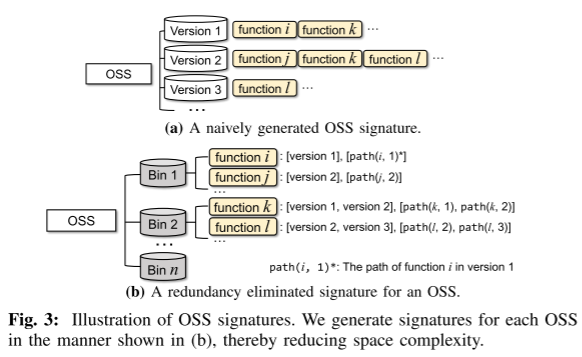

# CENTRIS - A Precise and Scalable Approach for Identifying Modified Open-Source Software Reuse

연도: 2021
요약: CENTRIS : 수정 및 중첩된 OSS 재사용 탐지 기법
중복 제거 : 버전 간 공통 함수 인덱싱으로 비교 효율 45 배 향상 
코드 세그멘테이션 : 고유 코드 추출을 통해 중첩 구조 오탐  차단
출판: Conference, TOP TIER

[CENTRIS - A Precise and Scalable Approach for Identifying Modified Open-Source Software Reuse.pdf](CENTRIS_-_A_Precise_and_Scalable_Approach_for_Identifying_Modified_Open-Source_Software_Reuse.pdf)

# **1. 핵심 문제 (Problem Definition)**

- **수정된 재사용 (Modified Reuse)**: 개발자는 오픈 소스 (**OSS**) 를 그대로 쓰기보다 코드 일부를 수정하거나 필요한 부분만 발췌하여 사용하는 문제가 있다. (**95%** 가 수정된 재사용)
- **중첩된 구조 (Nested Components)**: **OSS** 가 또 다른 **OSS** 를 포함하는 경우, 기존 도구들은 이를 구분하지 못해 대량의 오탐(**False Positive**) 을 발생시킨다.
- **확장성 (Scalability)**: 수십억 줄의 대규모 코드베이스를 빠르게 전수 조사하기에는 기존 기법들의 속도가 너무 느리다는 문제가 있다.

---

# **2. 제안 솔루션 (Proposed Method)**

- **중복 제거 (Redundancy Elimination)**: 수만 개의 버전에서 겹치는 함수들을 한 번만 인덱싱하여 비교 대상을 **2.2%** 수준으로 압축, 공간 및 시간 효율성을 **45** 배 향상 시켰다.
- **코드 세그멘테이션 (Code Segmentation)**: **OSS** 를 '고유 코드' 와 '외부 차용 코드' 로 분리합니다. 타겟 소프트웨어가 **OSS** 의 고유한 부분만 얼마나 쓰는지 분석하여 중첩된 구조에 의한 오탐을 차단한다.

---

## 1) 구성 요소 **DB** 구축 단계 (**P1**): 중복 제거 (**Redundancy Elimination**)

### 가. 중복 제거의 원리 (**Fig. 3**)



- **기존 방식 (Fig. 3a)**: 모든 버전의 **OSS** 에서 함수를 각각 추출하여 저장하므로, 여러 버전에 걸쳐 존재하는 동일 함수가 중복 저장되어 비효율이 발생한다.
- **CENTRIS 방식 (Fig. 3b)**: **OSS** 내 모든 버전의 함수를 수집한 뒤, 중복된 함수는 단 한 번만 인덱싱하는 **OSS** 시그니처를 생성한다.
- **빈 (Bin) 구조**: 함수가 나타나는 버전의 수(n) 에 따라 n 개의 빈 (**Bin**) 을 생성하고, 각 함수가 속한 버전 및 경로 정보를 함께 기록한다.
    - **Bin 번호의 의미**: **Bin#$n$** 에서 $n$이 작을수록 희소성이 높아지며, **TF-IDF** 기반 가중치 계산 $W(f) = \log(n/|V(f)|)$ 에 의해 버전 식별 시 결정적인 역할을 수행함.

### 나. 기대 효과

- **데이터 압축**: 실험 결과, 비중복 함수는 전체의 약 **2.2%** 에 불과하여 비교 공간을 **45** 배 가량 줄였다.
- **확장성 확보**: **OSS** 가 지속적으로 업데이트 되어도 새로 추가된 함수만 인덱싱하므로 확장성이 뛰어났다.

---

## 2) 구성 요소 식별 단계 (**P2**): 코드 세그멘테이션 (**Code Segmentation**)

### 가. **Prime OSS** 탐지 및 유사도 측정 (**CHECKPRIME**)

- **탄생 시간 (Birth Time) 비교**: 두 **OSS** ($S$와$X$)가 공통 함수를 가질 때, 해당 함수가 각 **OSS** 에 처음 나타난 출시 날짜를 비교한다.
- **유사도 점수  ($\phi$) 계산**: $X$ 에서 $S$ 보다 먼저 탄생한 함수들의 비율을 측정한다.

$$
\phi(S, X) = \frac{|G|}{|X|}
$$

> $G$는 $X$에서 먼저 탄생한 공통 함수의 집합
> 


- **결정 규칙**: 이 점수가 임계값 ($\theta$) 이상이면 $S$ 는 다른 코드를 포함한 **Non-prime OSS** 로 간주된다.

> $\phi(S, X) \ge \theta$
> 

### 나. 응용 프로그램 코드 추출 (**Algorithm 1**)

- **코드 분리**: **Non-prime OSS** $(S)$ 의 전체 함수 집합에서 식별된 외부 차용 코드 ($P$) 를 제거하여 고유한 응용 프로그램 코드 ($S_{A}$) 를 추출한다.

$$
S_{A} = S \setminus P
$$

- **오탐 방지**: 이 과정을 통해 제 **3** 자 소프트웨어로 인한 허위 매칭 (**False Positive**) 을 원천적으로 차단한다.

### **다. 타겟 소프트웨어 내 구성 요소 식별**

- 최종적으로 타겟 소프트웨어 ($T$) 와 추출된 고유 코드 ($S_{A}$ ) 간의 유사도 $\Phi (T, S_{A})$ 를 계산하여 재사용 여부를 결정한다.

$$
\Phi(T, S_{A}) = \frac{|T \cap S_{A}|}{|S_{A}|}
$$

### **라. Case Study**

- 시나리오를 통한 사례 분석
    
    ## **1. 가상 시나리오 설정**
    
    **OSS 프로젝트:** 라이브러리 A (Library A)이 라이브러리는 총 3 개의 버전을 가지고 있으며, 내부적으로 라이브러리 B (Library B) 의 함수를 하나 포함하고 있습니다.
    
    - **v1.0**: `func_1`, `func_borrowed` (Library B에서 가져옴)
    - **v2.0**: `func_1`, `func_borrowed`, `func_2` (새 기능 추가)
    - **v3.0**: `func_1_mod` (`func_1`을 수정함), `func_borrowed`, `func_2`
    
    **타겟 소프트웨어 (Target T)**
    개발자가 **Library A v3.0** 을 가져와서 다음과 같이 구성했습니다.
    
    - `func_1_mod` (그대로 사용)
    - `func_borrowed` (그대로 사용)
    - `func_custom` (개발자가 직접 만든 함수)
    - (`func_2` 는 필요 없어서 삭제함 - **Partial Reuse**)
    
    ## 2. 알고리즘 적용 과정
    
    ### **단계 1: P1 - 중복 제거 및 빈 (Bin) 생성**
    
    | 함수명 | 나타난 버전 | 할당된 빈 (Bin) | 설명 |
    | --- | --- | --- | --- |
    | `func_1` | v1, v2 | Bin#2 | 초기 버전들에 공통된 함수 |
    | `func_borrowed`  | v1, v2, v3 | Bin#3 | 모든 버전에 존재하는 함수 |
    | `func_2`  | v2, v3 | Bin#2 | 중간에 추가된 함수 |
    | `func_1_mod`  | v3 | Bin#1 | 최신 버전에만 있는 고유 함수 |
    
    ### 단계 2: **P2** - 코드 세그멘테이션 (**Code Segmentation**)
    
    이제 이 함수들 중 **Library A** 가 직접 만든 것만 골라냅니다. 
    
    - **탄생 시간 (Birth Time) 조사**: `func_borrowed` 가 **Library B** 에서 더 먼저 출시되었음을 확인한다.
    - **응용 프로그램 코드 ($S_A$ ) 추출**: `func_borrowed` 를 제외한 집합을 만든다.
        ◦ **Library A** 의 고유 코드 집합 $S_A$ = {`func_1`, `func_2`, `func_1_mod`}
    
    ### 단계 3: **P2** - 구성 요소 식별 및 유사도 계산
    
    타겟 소프트웨어 **T** 에 **Library A** 의 고유 코드가 얼마나 있는지 계산한다.
    
    - **T** 에 존재하는 **Library A** 의 고유 함수: {`func_1_mod`} (1개)
    - **Library A (v3.0)** 의 전체 고유 함수: {`func_1_mod`, `func_2`} (2개)
    - 유사도 계산: $\Phi(T, S_A) = \frac{1}{2} = 0.5 \text{ (50\%)}$
    - **결과**: 임계값 $0.1$ 보다 높으므로 **Library A** 가 재사용된 것으로 판정한다.
    
    ### 단계 4: 버전 식별 (**Version Identification**)
    
    타겟에 있는 함수들의 가중치 $(W )$ 를 합산하여 가장 점수가 높은 버전을 찾는다.
    
    - `func_1_mod`: **Bin#1** 에 있으므로 희소성이 매우 높아 높은 가중치를 받는다.
    - 이 가중치 점수가 **v3.0** 에만 몰리게 되어, **CENTRIS** 는 타겟이 **v3.0** 을 썼음을 정확히 집어낸다.

---

# 3. 주요 성과 및 결과 (Evaluation)

- **정확도**: **91%** 의 정밀도와 **94%** 의 재현율을 기록하며, 기존 최신 기술인 **Déjà Vu** (정밀도 **10%** 미만) 를 압도했다.
- **성능**: **100** 만 줄의 프로그램을 **800** 억 줄 규모의 **DB** 와 비교하는 데 평균 **1** 분 미만이 소요된다.
- **보안 활용**: 실제 **Godot**, **Redis**, **Audacity** 등 유명 프로젝트에서 패치되지 않은 채 재사용된 취약점을 탐지하고 제보하는 성과를 거두었다.

---

# **4. 논문 코드 분석**

논문 Github: https://github.com/WOOSEUNGHOON/Centris-public

## **1) 소스에서 “전체 파이프 라인” 실행 순서 (DB 구축부터 탐지까지)**

논문 재현의 Case 1에 해당하는 흐름이며, 모듈 순서가 명확하다.

### **1-1. OSSCollector (수집 단계)**

목적: Component DB에 들어갈 OSS 후보 repo들을 대량으로 **클론하고**, 버전/함수 정보를 모으는 준비 단계

실행 순서:

1. (입력 준비) OSS repo들의 `git clone URL` 목록 파일 준비
    - README에 있는 `src/osscollector/sample` 같은 형태
2. `OSS_Collector.py`에서 경로 설정
    - cloned repo 저장 위치, 날짜/함수 결과 저장 위치 등(README에 line 17~21 언급)
3. 실행
    - `python3 OSS_Collector.py`
4. 산출물 확인(기본 경로 기준)
    - `./osscollector/repo_src/` : 클론된 소스
    - `./osscollector/repo_date/` : 버전(릴리즈) 날짜 데이터
    - `./osscollector/repo_functions/` : 추출된 함수들

정리: **URL 목록 준비 → 경로 설정 → OSS_Collector 실행 → repo/날짜/함수 산출물 생성**

---

### **1-2. Preprocessor (DB 구축 단계)**

목적: 수집된 데이터를 바탕으로 **컴포넌트 DB(componentDB)** 및 각종 인덱스/메타/가중치 등을 생성

실행 순서:

1. `Preprocessor_full.py` 또는 `Preprocessor_lite.py` 중 선택
2. 해당 스크립트에서 경로 설정(입력/출력 directory 등)
3. 실행
    - `python3 Preprocessor_full.py` 또는 `python3 Preprocessor_lite.py`
4. 산출물 확인(기본 경로 기준)
    - `./preprocessor/componentDB/`
    - `./preprocessor/verIDX/`
    - `./preprocessor/metaInfos/`
    - `./preprocessor/weights/`
    - `./preprocessor/funcDate/`

정리: **전처리 스크립트 선택 → 경로 설정 → Preprocessor 실행 → componentDB 포함 산출물 생성**

---

### **1-3. Detector (탐지 단계)**

목적: 위에서 만든 componentDB를 사용해 “대상 소프트웨어”의 OSS component를 식별

실행 순서:

1. `Detector.py`에서
    - componentDB 경로
    - 결과 저장 경로를 설정
2. 실행
    - `python3 Detector.py /path/of/the/target/software`
3. 결과 확인
    - 기본 출력: `./detector/res/`

정리: **Detector 설정(DB/출력 경로) → Detector 실행(대상 소프트웨어 입력) → 결과 확인**

위의 내용의 전체 내용을 정리하면 다음의 한 문장으로 정리 된다.

**전체 구축/탐지:** `OSSCollector → Preprocessor → Detector`

---

## 2) OSS_Collector.py 코드 분석

- **전체 코드**
    
    ```python
    """
    Dataset Collection Tool.
    Author:		Seunghoon Woo (seunghoonwoo@korea.ac.kr)
    Modified: 	December 16, 2020.
    """
    
    import os
    import sys
    import subprocess
    import re
    import tlsh # Please intall python-tlsh
    
    """GLOBALS"""
    
    currentPath	= os.getcwd()
    gitCloneURLS= currentPath + "/sample" 			# Please change to the correct file (the "sample" file contains only 10 git-clone urls)
    clonePath 	= currentPath + "/repo_src/"		# Default path
    tagDatePath = currentPath + "/repo_date/"		# Default path
    resultPath	= currentPath + "/repo_functions/"	# Default path
    ctagsPath	= "/usr/local/bin/ctags" 			# Ctags binary path (please specify your own ctags path)
    
    # Generate directories
    shouldMake = [clonePath, tagDatePath, resultPath]
    for eachRepo in shouldMake:
    	if not os.path.isdir(eachRepo):
    		os.mkdir(eachRepo)
    
    # Generate TLSH
    def computeTlsh(string):
    	string 	= str.encode(string)
    	hs 		= tlsh.forcehash(string)
    	return hs
    
    def removeComment(string):
    	# Code for removing C/C++ style comments. (Imported from VUDDY and ReDeBug.)
    	# ref: https://github.com/squizz617/vuddy
    	c_regex = re.compile(
    		r'(?P<comment>//.*?$|[{}]+)|(?P<multilinecomment>/\*.*?\*/)|(?P<noncomment>\'(\\.|[^\\\'])*\'|"(\\.|[^\\"])*"|.[^/\'"]*)',
    		re.DOTALL | re.MULTILINE)
    	return ''.join([c.group('noncomment') for c in c_regex.finditer(string) if c.group('noncomment')])
    
    def normalize(string):
    	# Code for normalizing the input string.
    	# LF and TAB literals, curly braces, and spaces are removed,
    	# and all characters are lowercased.
    	# ref: https://github.com/squizz617/vuddy
    	return ''.join(string.replace('\n', '').replace('\r', '').replace('\t', '').replace('{', '').replace('}', '').split(' ')).lower()
    
    def hashing(repoPath):
    	# This function is for hashing C/C++ functions
    	# Only consider ".c", ".cc", and ".cpp" files
    	possible = (".c", ".cc", ".cpp")
    	
    	fileCnt  = 0
    	funcCnt  = 0
    	lineCnt  = 0
    
    	resDict  = {}
    
    	for path, dir, files in os.walk(repoPath):
    		for file in files:
    			filePath = os.path.join(path, file)
    
    			if file.endswith(possible):
    				try:
    					# Execute Ctgas command
    					functionList 	= subprocess.check_output(ctagsPath + ' -f - --kinds-C=* --fields=neKSt "' + filePath + '"', stderr=subprocess.STDOUT, shell=True).decode()
    
    					f = open(filePath, 'r', encoding = "UTF-8")
    
    					# For parsing functions
    					lines 		= f.readlines()
    					allFuncs 	= str(functionList).split('\n')
    					func   		= re.compile(r'(function)')
    					number 		= re.compile(r'(\d+)')
    					funcSearch	= re.compile(r'{([\S\s]*)}')
    					tmpString	= ""
    					funcBody	= ""
    
    					fileCnt 	+= 1
    
    					for i in allFuncs:
    						elemList	= re.sub(r'[\t\s ]{2,}', '', i)
    						elemList 	= elemList.split('\t')
    						funcBody 	= ""
    
    						if i != '' and len(elemList) >= 8 and func.fullmatch(elemList[3]):
    							funcStartLine 	 = int(number.search(elemList[4]).group(0))
    							funcEndLine 	 = int(number.search(elemList[7]).group(0))
    
    							tmpString	= ""
    							tmpString	= tmpString.join(lines[funcStartLine - 1 : funcEndLine])
    
    							if funcSearch.search(tmpString):
    								funcBody = funcBody + funcSearch.search(tmpString).group(1)
    							else:
    								funcBody = " "
    
    							funcBody = removeComment(funcBody)
    							funcBody = normalize(funcBody)
    							funcHash = computeTlsh(funcBody)
    
    							if len(funcHash) == 72 and funcHash.startswith("T1"):
    								funcHash = funcHash[2:]
    							elif funcHash == "TNULL" or funcHash == "" or funcHash == "NULL":
    								continue
    
    							storedPath = filePath.replace(repoPath, "")
    							if funcHash not in resDict:
    								resDict[funcHash] = []
    							resDict[funcHash].append(storedPath)
    
    							lineCnt += len(lines)
    							funcCnt += 1
    
    				except subprocess.CalledProcessError as e:
    					print("Parser Error:", e)
    					continue
    				except Exception as e:
    					print ("Subprocess failed", e)
    					continue
    
    	return resDict, fileCnt, funcCnt, lineCnt 
    
    def indexing(resDict, title, filePath):
    	# For indexing each OSS
    
    	fres = open(filePath, 'w')
    	fres.write(title + '\n')
    
    	for hashval in resDict:
    		if hashval == '' or hashval == ' ':
    			continue
    
    		fres.write(hashval)
    		
    		for funcPath in resDict[hashval]:
    			fres.write('\t' + funcPath)
    		fres.write('\n')
    
    	fres.close()
    
    def main():
    	with open(gitCloneURLS, 'r', encoding = "UTF-8") as fp:
    		funcDateDict = {}
    		lines		 = [l.strip('\n\r') for l in fp.readlines()]
    		
    		for eachUrl in lines:
    			os.chdir(currentPath)
    			repoName 	= eachUrl.split("github.com/")[1].replace(".git", "").replace("/", "@@") # Replace '/' -> '@@' for convenience
    			print ("[+] Processing", repoName)
    
    			try:
    				cloneCommand 	= eachUrl + ' ' + clonePath + repoName
    				cloneResult 	= subprocess.check_output(cloneCommand, stderr = subprocess.STDOUT, shell = True).decode()
    
    				os.chdir(clonePath + repoName)
    
    				dateCommand 	= 'git log --tags --simplify-by-decoration --pretty="format:%ai %d"'  # For storing tag dates
    				dateResult		= subprocess.check_output(dateCommand, stderr = subprocess.STDOUT, shell = True).decode()
    				tagDateFile 	= open(tagDatePath + repoName, 'w')
    				tagDateFile.write(str(dateResult))
    				tagDateFile.close()
    
    				tagCommand		= "git tag"
    				tagResult		= subprocess.check_output(tagCommand, stderr = subprocess.STDOUT, shell = True).decode()
    
    				resDict = {}
    				fileCnt = 0
    				funcCnt = 0
    				lineCnt = 0
    
    				if tagResult == "":
    					# No tags, only master repo
    
    					resDict, fileCnt, funcCnt, lineCnt = hashing(clonePath + repoName)
    					if len(resDict) > 0:
    						if not os.path.isdir(resultPath + repoName):
    							os.mkdir(resultPath + repoName)
    						title = '\t'.join([repoName, str(fileCnt), str(funcCnt), str(lineCnt)])
    						resultFilePath 	= resultPath + repoName + '/fuzzy_' + repoName + '.hidx' # Default file name: "fuzzy_OSSname.hidx"
    						
    						indexing(resDict, title, resultFilePath)
    
    				else:
    					for tag in str(tagResult).split('\n'):
    						# Generate function hashes for each tag (version)
    
    						checkoutCommand	= subprocess.check_output("git checkout -f " + tag, stderr = subprocess.STDOUT, shell = True)
    						resDict, fileCnt, funcCnt, lineCnt = hashing(clonePath + repoName)
    						
    						if len(resDict) > 0:
    							if not os.path.isdir(resultPath + repoName):
    								os.mkdir(resultPath + repoName)
    							title = '\t'.join([repoName, str(fileCnt), str(funcCnt), str(lineCnt)])
    							resultFilePath 	= resultPath + repoName + '/fuzzy_' + tag + '.hidx'
    						
    							indexing(resDict, title, resultFilePath)
    						
    
    			except subprocess.CalledProcessError as e:
    				print("Parser Error:", e)
    				continue
    			except Exception as e:
    				print ("Subprocess failed", e)
    				continue
    
    """ EXECUTE """
    if __name__ == "__main__":
    	main()
    ```
    

### **Function 별 분석**

- GLOBALS
    
    ```python
    currentPath	= os.getcwd() # 실행 시점의 현재 작업 디렉토리. 
    													# 이후 모든 기본 경로의 기준점(base)로 사용.
    gitCloneURLS= currentPath + "/sample"		
    clonePath 	= currentPath + "/repo_src/"
    tagDatePath = currentPath + "/repo_date/"
    resultPath	= currentPath + "/repo_functions/"
    ctagsPath	= "/usr/local/bin/ctags" # C/C++ 함수 범위를 얻기 위한 ctags 실행 파일 경로.
    																	 # 환경마다 다르므로 사용자가 수정해야 함.
    
    # 디렉토리 생성 로직, 실행 시 기본 디렉토리 3개가 없으면 생성
    # repo_src/ : 소스 클론
    # repo_date/ : 태그 날짜 기록
    # repo_functions/ : 함수 지문 인덱스
    shouldMake = [clonePath, tagDatePath, resultPath]
    for eachRepo in shouldMake:
    	if not os.path.isdir(eachRepo):
    		os.mkdir(eachRepo)
    ```
    
- computeTlsh(string)
    
    ```python
    # Generate TLSH
    # 목적: 입력 문자열(정규화된 함수 바디)에 대해 TLSH 지문(fuzzy hash)을 생성.
    # “함수 구현이 약간 달라도” 매칭 가능성을 높이려는 의도
    def computeTlsh(string):
    	string 	= str.encode(string)   # 파이썬 문자열 -> 바이트 열로 변환
    	hs 		= tlsh.forcehash(string) # TLSH 해시 생성
    	return hs
    ```
    
- removeComment(string)
    
    ```python
    # 목적
    # 1) C/C++ 스타일 주석 제거(전처리).
    # 2) 함수 바디에서 주석을 제거하면 “주석만 다른 코드”를 동일하게 취급할 수 있음.
    # 핵심 아이디어
    # 정규식으로 문자열을 스캔하면서,
    # // ... 한 줄 주석과 # /* ... */ 여러 줄 주석을 제거하되,
    # 문자열 리터럴 "...", 문자 리터럴 '\'' 내부의 //, /* 등은 주석으로 오인하지 않도록 처리.
    def removeComment(string):
    	# Code for removing C/C++ style comments. (Imported from VUDDY and ReDeBug.)
    	# ref: https://github.com/squizz617/vuddy
    	c_regex = re.compile(
    		r'(?P<comment>//.*?$|[{}]+)|(?P<multilinecomment>/\*.*?\*/)|(?P<noncomment>\'(\\.|[^\\\'])*\'|"(\\.|[^\\"])*"|.[^/\'"]*)',
    		re.DOTALL | re.MULTILINE)
    	return ''.join([c.group('noncomment') for c in c_regex.finditer(string) if c.group('noncomment')])
    ```
    
- normalize(string)
    
    ```python
    # 목적
    # 코드 스타일 차이(공백/탭/줄바꿈/대괄호 등)를 제거해서 “형태만 다른 동일 구현”을 같은 것으로 만들기 위함.
    # 동작 방식
    # \n, \r, \t, {, } 제거, 공백 split 후 join (모든 스페이스 제거), 소문자화(lower())
    def normalize(string):
    	# Code for normalizing the input string.
    	# LF and TAB literals, curly braces, and spaces are removed,
    	# and all characters are lowercased.
    	# ref: https://github.com/squizz617/vuddy
    	return ''.join(string.replace('\n', '').replace('\r', '').replace('\t', '').replace('{', '').replace('}', '').split(' ')).lower()
    ```
    
- hashing(repoPath)
    
    ```python
    #목적
    # 특정 레포 경로(repoPath) 아래를 순회하면서 C/C++ 함수 단위로:
    # 1) 함수 바디 추출
    # 2) 주석 제거 + 정규화
    # 3) TLSH 지문 생성
    # 4) hash -> [함수가 있던 파일 경로들] 형태로 누적
    
    # 함수 입력/출력
    # 입력: repoPath (예: repo_src/<repoName>)
    # 출력: (resDict, fileCnt, funcCnt, lineCnt)
    # resDict: { funcHash: [storedPath1, storedPath2, ...] }
    # fileCnt: 처리한 소스 파일 수
    # funcCnt: 처리한 함수 수
    # lineCnt: 라인 수 카운트(아래 “주의점” 참고)
    
    def hashing(repoPath):
    	possible = (".c", ".cc", ".cpp")
    	
    	fileCnt  = 0
    	funcCnt  = 0
    	lineCnt  = 0
    
    	resDict  = {}
    	# 1) 파일 탐색: .c/.cc/.cpp만 분석 대상으로 제한한다.
    	for path, dir, files in os.walk(repoPath):
    		for file in files:
    			filePath = os.path.join(path, file)
    
    			if file.endswith(possible):
    				try:
    					# 2) ctags로 함수 목록 가져오기
    					# ctags -f - : 결과를 파일이 아니라 stdout으로 출력
    					# --kinds-C=* : C 언어 관련 가능한 tag 종류 전부(함수 포함)
    					# --fields=neKSt : 출력에 여러 필드 포함 (라인/엔드라인 등)
    					# 이후 이 결과를 줄 단위로 파싱해서 “함수 시작/끝 라인”을 뽑아냄.
    					functionList 	= subprocess.check_output(ctagsPath + ' -f - --kinds-C=* --fields=neKSt "' + filePath + '"', stderr=subprocess.STDOUT, shell=True).decode()
    
    					f = open(filePath, 'r', encoding = "UTF-8")
    
    					# For parsing functions
    					# 3) 원본 파일을 통째로 읽어서 라인 배열로 보관
    					lines 		= f.readlines()
    					# 4) ctags 출력 파싱해서 함수 범위 추출
    					# 각 ctags 라인(i)에 대해:
    					#	  탭 기준으로 split한 elemList를 만들고,
    					#	  elemList[3] == "function" 인 항목만 “함수”로 취급.
    					#	  elemList[4]에서 시작 라인 번호, elemList[7]에서 끝 라인 번호를 정규식으로 추출.
    					allFuncs 	= str(functionList).split('\n')
    					func   		= re.compile(r'(function)')
    					number 		= re.compile(r'(\d+)')
    					funcSearch	= re.compile(r'{([\S\s]*)}')
    					tmpString	= ""
    					funcBody	= ""
    
    					fileCnt 	+= 1
    
    					for i in allFuncs:
    						elemList	= re.sub(r'[\t\s ]{2,}', '', i)
    						elemList 	= elemList.split('\t')
    						funcBody 	= ""
    
    						if i != '' and len(elemList) >= 8 and func.fullmatch(elemList[3]):
    							funcStartLine 	 = int(number.search(elemList[4]).group(0))
    							funcEndLine 	 = int(number.search(elemList[7]).group(0))
    							
    							# 5) 함수 바디 추출
    							# 시작~끝 라인 텍스트를 이어 붙인 뒤,
    							# 정규식 { ... }로 감싸진 내부를 추출.
    							# 만약 {} 구조를 못 찾으면 " "로 처리.
    							# 한계: 중괄호가 여러 번 등장하는 복잡한 케이스(중첩, 매크로, 잘린 범위 등)에서 바디 추출이 부정확할 수 있다.
    							# 또한 funcSearch = r'{([\S\s]*)}'는 기본적으로 “가장 바깥/가장 마지막”까지 잡아먹는 경향(탐욕적)이라 예상과 다르게 잡힐 수 있다.
    							tmpString	= ""
    							tmpString	= tmpString.join(lines[funcStartLine - 1 : funcEndLine])
    
    							if funcSearch.search(tmpString):
    								funcBody = funcBody + funcSearch.search(tmpString).group(1)
    							else:
    								funcBody = " "
    							
    							# 6) 주석 제거 + 정규화 + TLSH
    							funcBody = removeComment(funcBody)
    							funcBody = normalize(funcBody)
    							funcHash = computeTlsh(funcBody)
    							
    							# 7) TLSH 결과 후처리
    							# TLSH 라이브러리에 따라 해시가 "T1..."로 시작하고 
    							# 길이가 72인 형식이 나올 수 있는데, 
    							# 여기서는 앞의 "T1"를 제거해서 저장.
    							# 무효 해시(TNULL, 빈 문자열 등)는 스킵.
    							if len(funcHash) == 72 and funcHash.startswith("T1"):
    								funcHash = funcHash[2:]
    							elif funcHash == "TNULL" or funcHash == "" or funcHash == "NULL":
    								continue
    							
    							# 8) 저장 경로 기록
    							# 레포 루트로부터의 상대경로처럼 저장.
    							# 같은 함수 지문이 여러 파일에서 나오면 리스트에 누적(복제 코드/공통 라이브러리/동일 구현 등).
    							storedPath = filePath.replace(repoPath, "")
    							if funcHash not in resDict:
    								resDict[funcHash] = []
    							resDict[funcHash].append(storedPath)
    							
    							# 9) 카운터 증가
    							lineCnt += len(lines)
    							funcCnt += 1
    
    				except subprocess.CalledProcessError as e:
    					print("Parser Error:", e)
    					continue
    				except Exception as e:
    					print ("Subprocess failed", e)
    					continue
    
    	return resDict, fileCnt, funcCnt, lineCnt
    ```
    
- indexing(resDict, title, filePath)
    
    ```python
    # 목적: hashing() 결과를 .hidx 인덱스 파일로 저장.
    
    # 출력 포맷
    # 첫 줄: title
    #	  title = '\t'.join([repoName, fileCnt, funcCnt, lineCnt])
    #	  즉: repoName<TAB>fileCnt<TAB>funcCnt<TAB>lineCnt
    # 이후 각 줄:
    #	  hashval\t<path1>\t<path2>...\n
    #	  hashing() 결과를 .hidx 인덱스 파일로 저장.
    
    def indexing(resDict, title, filePath):
    
    	fres = open(filePath, 'w')
    	fres.write(title + '\n')
    
    	for hashval in resDict:
    		if hashval == '' or hashval == ' ':
    			continue
    
    		fres.write(hashval)
    		
    		for funcPath in resDict[hashval]:
    			fres.write('\t' + funcPath)
    		fres.write('\n')
    
    	fres.close()
    ```
    
- main()
    
    ```python
    # 목적: OSS 목록을 읽어서, 레포를 버전별로 해싱하고 인덱스 파일을 떨어뜨리는 오케스트레이션
    def main():
    	# 1) URL 목록 읽기
    	with open(gitCloneURLS, 'r', encoding = "UTF-8") as fp:
    		funcDateDict = {}
    		lines		 = [l.strip('\n\r') for l in fp.readlines()]
    		
    		# 2) 각 URL 처리 루프
    		# repoName을 파일시스템에 안전하게 쓰기 위해 /를 @@로 치환.
    		for eachUrl in lines:
    			os.chdir(currentPath)
    			repoName 	= eachUrl.split("github.com/")[1].replace(".git", "").replace("/", "@@") # Replace '/' -> '@@' for convenience
    			print ("[+] Processing", repoName)
    
    			try:
    				# 3) clone + tag 날짜 저장
    				# 태그가 가리키는 커밋들의 로그를 단순화해서 날짜/장식(tag 정보)을 저장.
    				cloneCommand 	= eachUrl + ' ' + clonePath + repoName
    				cloneResult 	= subprocess.check_output(cloneCommand, stderr = subprocess.STDOUT, shell = True).decode()
    
    				os.chdir(clonePath + repoName)
    
    				dateCommand 	= 'git log --tags --simplify-by-decoration --pretty="format:%ai %d"'  # For storing tag dates
    				dateResult		= subprocess.check_output(dateCommand, stderr = subprocess.STDOUT, shell = True).decode()
    				tagDateFile 	= open(tagDatePath + repoName, 'w')
    				tagDateFile.write(str(dateResult))
    				tagDateFile.close()
    
    				# 4) tag 목록 확인 후 분기
    				tagCommand		= "git tag"
    				tagResult		= subprocess.check_output(tagCommand, stderr = subprocess.STDOUT, shell = True).decode()
    
    				resDict = {}
    				fileCnt = 0
    				funcCnt = 0
    				lineCnt = 0
    
    				# 4) (a) 태그가 없는 경우
    				# 현재 브랜치(보통 master/main)의 스냅샷 1개만 해싱:
    				if tagResult == "":
    					# No tags, only master repo
    
    					resDict, fileCnt, funcCnt, lineCnt = hashing(clonePath + repoName)
    					if len(resDict) > 0:
    						if not os.path.isdir(resultPath + repoName):
    							os.mkdir(resultPath + repoName)
    						title = '\t'.join([repoName, str(fileCnt), str(funcCnt), str(lineCnt)])
    						resultFilePath 	= resultPath + repoName + '/fuzzy_' + repoName + '.hidx' # Default file name: "fuzzy_OSSname.hidx"
    						
    						indexing(resDict, title, resultFilePath)
    				
    				# 4) (b) 태그가 있는 경우
    				# 태그를 한 줄씩 돌며, 각 태그로 강제 체크아웃 후 해싱:
    				else:
    					for tag in str(tagResult).split('\n'):
    						# Generate function hashes for each tag (version)
    
    						checkoutCommand	= subprocess.check_output("git checkout -f " + tag, stderr = subprocess.STDOUT, shell = True)
    						resDict, fileCnt, funcCnt, lineCnt = hashing(clonePath + repoName)
    						
    						if len(resDict) > 0:
    							if not os.path.isdir(resultPath + repoName):
    								os.mkdir(resultPath + repoName)
    							title = '\t'.join([repoName, str(fileCnt), str(funcCnt), str(lineCnt)])
    							resultFilePath 	= resultPath + repoName + '/fuzzy_' + tag + '.hidx'
    						
    							indexing(resDict, title, resultFilePath)
    						
    			# 5) 결과 디렉토리 구조 예시
    			# repo_functions/<repoName>/fuzzy_<repoName>.hidx (태그 없음)
    			# repo_functions/<repoName>/fuzzy_v1.2.3.hidx (태그 있음)
    			except subprocess.CalledProcessError as e:
    				print("Parser Error:", e)
    				continue
    			except Exception as e:
    				print ("Subprocess failed", e)
    				continue
    ```
    

---

## 3-1) Preprocessor_full.py 코드 분석

- **전체 코드**
    
    ```python
    """
    Preprocessor.
    Author:		Seunghoon Woo (seunghoonwoo@korea.ac.kr)
    Modified: 	December 16, 2020.
    """
    
    import os
    import sys
    import re
    import shutil
    import json
    import math
    import tlsh
    
    """GLOBALS"""
    currentPath		= os.getcwd()
    separator 		= "#@#"	
    sep_len			= len(separator)					
    # So far, do not change
    
    theta 			= 0.1										# Default value (0.1)
    tagDatePath 	= "../osscollector/repo_date/" 				# Default path
    resultPath		= "../osscollector/repo_functions/" 		# Default path
    verIDXpath		= currentPath + "/verIDX/"					# Default path
    initialDBPath	= currentPath + "/initialSigs/"  			# Default path
    finalDBPath		= currentPath + "/componentDB/"  			# Default path of the final Component DB
    metaPath		= currentPath + "/metaInfos/"				# Default path, for saving pieces of meta-information of collected repositories
    weightPath		= metaPath 	  + "/weights/"					# Default path, for version prediction
    funcDatePath	= currentPath + "/funcDate/"				# Default path
    
    # Generate directories
    shouldMake 	= [verIDXpath, initialDBPath, finalDBPath, metaPath, funcDatePath, weightPath]
    for eachRepo in shouldMake:
    	if not os.path.isdir(eachRepo):
    		os.mkdir(eachRepo)
    
    funcDateDict	= {}
    
    def extractVerDate(repoName):
    	# For extracting version (tag) date
    
    	verDateDict = {}
    	if os.path.isfile(os.path.join(tagDatePath, repoName)):
    		with open(os.path.join(tagDatePath, repoName), 'r', encoding = "UTF-8") as fp:
    			body = ''.join(fp.readlines()).strip()
    			for eachLine in body.split('\n'):
    				versionList = []
    				if "tag:" in eachLine:
    					date = eachLine[0:10]
    
    					if "," in eachLine:
    						verList = [x for x in eachLine.split("tag: ")]
    						for val in verList[1:]:
    							if ',' in val:
    								versionList.append(val.split(',')[0])
    							elif ')' in val:
    								versionList.append(val.split(')')[0])
    					else:
    						versionList = [(eachLine.split('tag: ')[1][:-1])]
    
    					for eachVersion in versionList:
    						verDateDict[eachVersion] = date
    			
    	return verDateDict
    
    def redundancyElimination():
    	for repoName in os.listdir(resultPath):
    		print (repoName)
    
    		funcDateDict			= {}
    		tempDateDict			= {}
    		verDateDict				= extractVerDate(repoName)
    		
    
    		# if os.path.isfile(os.path.join(initialDBPath, repoName + "_sig")):
    		# 	continue
    		## For skipping already generated Sigs
    
    		verTempLst = []
    		signature  = {}
    		verDict    = {}
    		idx        = 0		
    
    		for eachVersion in os.listdir(os.path.join(resultPath, repoName)):
    			versionName = eachVersion.split("fuzzy_")[1].replace(".hidx", "")
    			if versionName == '' or versionName == ' ':
    				continue
    			verTempLst.append(versionName)
    		verTempLst.sort()
    
    		try:
    			for versionName in verTempLst:
    				with open(os.path.join(resultPath, repoName, ("fuzzy_" + versionName + ".hidx")), 'r', encoding = "UTF-8") as fp:
    					verDict[versionName] = idx
    					idx += 1
    					body = ''.join(fp.readlines()).strip()
    					for eachLine in body.split('\n')[1:-1]:
    						if eachLine == '' or eachLine == ' ':
    							continue
    
    						hashval = eachLine.split('\t')[0]
    						if hashval not in signature:
    							signature[hashval]	 	= []
    							tempDateDict[hashval] 	= []
    						signature[hashval].append(str(idx-1))
    						
    						if versionName in verDateDict:
    							tempDateDict[hashval].append(verDateDict[versionName])
    						else:
    							tempDateDict[hashval].append("NODATE")
    
    		except Exception as e:
    			print ("Parsing error: ", e)
    			continue
    
    		# For storing function birthdate
    		for hashval in tempDateDict:
    			tempDateDict[hashval].sort()
    			funcDateDict[hashval] = tempDateDict[hashval][0]
    
    		fdate = open(funcDatePath + repoName + "_funcdate", 'w')
    		for hashval in funcDateDict:
    			fdate.write(hashval + '\t' + funcDateDict[hashval] + '\n')
    		fdate.close()
    
    		# For storing version indexes
    		fidx = open(verIDXpath + repoName + "_idx", 'w')
    		saveJson = []
    
    		for verName in verTempLst:
    			temp = {}
    			temp["ver"] = verName
    			temp["idx"] = str(verDict[verName])
    			saveJson.append(temp)
    
    		fidx.write(json.dumps(saveJson))
    		fidx.close()
    		
    		
    		# For storing OSS signatures
    		f = open(initialDBPath + repoName + "_sig", 'w')
    
    		saveJson = []
    		for hashval in signature:
    			temp = {}
    			temp["hash"] = hashval
    			temp["vers"] = signature[hashval]
    			saveJson.append(temp)
    		f.write(json.dumps(saveJson))
    		f.close()
    
    def saveMetaInfos():
    	aveFuncJson = {}
    	allFuncJson = {}
    	uniqueJson	= []
    	unique 		= {}
    
    	fave = open(metaPath + "aveFuncs", 'w')
    	fall = open(metaPath + "allFuncs", 'w')
    	funi = open(metaPath + "uniqueFuncs", 'w')
    	
    
    	for OSS in os.listdir(initialDBPath):
    		weightJson	= {}
    		repoName 	= OSS.replace("_sig", "")
    		totFuncs 	= 0
    		totVers 	= len(os.listdir(resultPath + repoName))
    	
    		if totVers == 0:
    			continue
    
    		fwei = open(weightPath + "/" + repoName + "_weights", 'w')
    
    		
    		with open(initialDBPath + OSS, 'r', encoding = "UTF-8") as fs:
    			jsonStr = json.load(fs)
    			totFuncs = len(jsonStr)
    			
    			for eachJson in jsonStr:
    				hashval = eachJson['hash']
    				verlst 	= eachJson['vers']
    
    				if hashval not in unique:
    					unique[hashval] = []
    
    				unique[hashval].append(repoName)
    				weightJson[hashval] = math.log(float(totVers)/float(len(verlst)))
    
    		aveFuncJson[repoName]	= int(totFuncs/totVers)
    		allFuncJson[repoName] 	= int(totFuncs)
    
    		fwei.write(json.dumps(weightJson))
    		fwei.close()
    
    	for funcHash in unique:
    		temp = {}
    		temp["hash"] 	= funcHash
    		temp["OSS"]		= unique[funcHash]
    		uniqueJson.append(temp)
    
    	fave.write(json.dumps(aveFuncJson))
    	fall.write(json.dumps(allFuncJson))
    	funi.write(json.dumps(uniqueJson))
    
    	fave.close()
    	fall.close()
    	funi.close()
    
    def readVerDate(verDateDict, repoName):
    	verDateDict[repoName] = {}
    
    	if os.path.isfile(funcDatePath + repoName + "_funcdate"):
    		with open(funcDatePath + repoName + "_funcdate", 'r', encoding = "UTF-8") as fp:
    			body = ''.join(fp.readlines()).strip()
    			for eachLine in body.split('\n'):
    				hashval = eachLine.split('\t')[0]
    				date 	= eachLine.split('\t')[1]
    				verDateDict[repoName][hashval] = date
    	return verDateDict
    
    def getAveFuncs():
    	aveFuncs = {}
    	with open(metaPath + "aveFuncs", 'r', encoding = "UTF-8") as fp:
    		aveFuncs = json.load(fp)
    	return aveFuncs
    
    def codeSegmentation():
    	aveFuncs = getAveFuncs()
    
    	# For printing process #
    	l 	= 1
    	tot = len(os.listdir(initialDBPath))
    	print ('[+] Read OSS signatures..')
    	########################
    
    	OSSList = os.listdir(initialDBPath)
    	
    	versSignatures 	= {}
    	dateSignatures	= {}
    	uniqueFuncs	 	= {}
    
    	with open(metaPath + "uniqueFuncs", 'r', encoding = "UTF-8") as fp:
    		jsonStr = json.load(fp)
    		for eachVal in jsonStr:
    			hashval 			 = eachVal['hash']
    			uniqueFuncs[hashval] = eachVal['OSS']
    			
    
    	verDateDict = {}
    
    	for S_sig in OSSList:
    		print (l, '/', tot, S_sig)
    		
    		S = S_sig.replace("_sig", "")
    		l += 1
    
    		possibleMembers	 	= {}
    		candiX				= {}
    		removedFuncs		= []
    		
    
    		if S not in verDateDict:
    			verDateDict = readVerDate(verDateDict, S)
    		
    		with open(initialDBPath + S_sig, 'r', encoding = "UTF-8") as fs:
    			jsonStr = json.load(fs)
    			if len(jsonStr) == 0:
    				continue
    			else:
    				temp = {}
    				for eachVal in jsonStr:
    					hashval = eachVal['hash']
    					
    					for OSS in uniqueFuncs[hashval]:
    						if OSS == S:
    							continue
    
    						if OSS not in candiX:
    							temp[OSS] 	= []
    							candiX[OSS] = 0
    
    						if OSS not in verDateDict:
    							verDateDict = readVerDate(verDateDict, OSS)
    						
    						try:
    							for S_hashval in verDateDict[S]:
    								score = tlsh.diffxlen(hashval, S_hashval)
    								if int(score) <= 30:
    									if verDateDict[S][hashval] == "NODATE" or verDateDict[OSS][hashval] == "NODATE":
    										candiX[OSS] += 1
    										temp[OSS].append(hashval)
    										
    									elif verDateDict[OSS][hashval] <= verDateDict[S][hashval]:
    										candiX[OSS] += 1
    										temp[OSS].append(hashval)
    						except:
    							pass
    
    				for X in candiX:
    					if aveFuncs[X] == 0:
    						continue
    
    					elif len(verDateDict[X]) ==0:
    						continue
    
    					elif (float(candiX[X])/float(aveFuncs[X])) >= theta:
    						if S not in possibleMembers:
    							possibleMembers[S] = []
    
    						possibleMembers[S].append(X)
    						removedFuncs.extend(temp[X])
    
    				if S not in possibleMembers:
    					shutil.copy(os.path.join(initialDBPath, S)+"_sig", os.path.join(finalDBPath, S)+"_sig")
    
    				else:
    					removedFuncs = set(removedFuncs)
    					saveJson = []
    					fres = open(os.path.join(finalDBPath, S)+"_sig", 'w')
    				
    					for eachVal in jsonStr:
    						temp = {}
    						hashval = eachVal['hash']
    
    						if hashval not in removedFuncs:
    							versLst = eachVal['vers']
    							temp["hash"] = hashval
    							temp["vers"] = versLst
    							saveJson.append(temp)
    					
    					fres.write(json.dumps(saveJson))
    					fres.close()
    
    def main():
    	redundancyElimination()
    	saveMetaInfos()
    	codeSegmentation()
    
    """ EXECUTE """
    if __name__ == "__main__":
    	main()
    ```
    

### **Function 별 분석**

- GLOBALS
    
    ```python
    # 실행 위치(작업 디렉토리). 이후 생성할 DB 디렉토리들의 기준.
    currentPath		= os.getcwd()
    separator 		= "#@#"	
    sep_len			= len(separator)					
    # So far, do not change
    
    # (S와 X 사이의 제거 후보 함수 수 / X의 평균 함수 수) >= theta 이면 X를 포함 멤버로 보고 S에서 해당 함수들을 제거
    theta 			= 0.1
    # 입력 경로
    tagDatePath 	= "../osscollector/repo_date/" 				# Default path
    resultPath		= "../osscollector/repo_functions/" 		# Default path
    # 출력/중간 산출물 경로
    verIDXpath		= currentPath + "/verIDX/"					# Default path
    initialDBPath	= currentPath + "/initialSigs/"  			# Default path
    finalDBPath		= currentPath + "/componentDB/"  			# Default path of the final Component DB
    metaPath		= currentPath + "/metaInfos/"				# Default path, for saving pieces of meta-information of collected repositories
    weightPath		= metaPath 	  + "/weights/"					# Default path, for version prediction
    funcDatePath	= currentPath + "/funcDate/"				# Default path
    
    # Generate directories
    shouldMake 	= [verIDXpath, initialDBPath, finalDBPath, metaPath, funcDatePath, weightPath]
    for eachRepo in shouldMake:
    	if not os.path.isdir(eachRepo):
    		os.mkdir(eachRepo)
    
    funcDateDict	= {}
    ```
    
- extractVerDate(repoName)
    
    ```python
    # 목적
    # repo_date/<repoName> 파일에서 tag(버전) → 날짜(YYYY-MM-DD) 매핑을 뽑아낸다.
    
    # 입력/출력
    # 입력: repoName (디렉토리명 그대로, 예: owner@@repo)
    # 출력: verDateDict
    # 형태: { "v1.2.3": "2020-12-16", ... }
    
    # 동작 원리
    # 1) tagDatePath/repoName 파일이 있으면 읽음.
    # 2) 각 줄에서 "tag:"가 있는지 확인.
    # 3) date = eachLine[0:10]으로 앞 10글자를 날짜로 간주(예: 2020-12-16)
    # 4) 한 줄에 tag가 여러 개 있을 수 있어:
    # 5) "," 또는 ")"로 잘라 tag 이름만 추출
    # 6) 각 tag에 대해 verDateDict[tag] = date
    
    def extractVerDate(repoName):
    	verDateDict = {}
    	if os.path.isfile(os.path.join(tagDatePath, repoName)):
    		with open(os.path.join(tagDatePath, repoName), 'r', encoding = "UTF-8") as fp:
    			body = ''.join(fp.readlines()).strip()
    			for eachLine in body.split('\n'):
    				versionList = []
    				if "tag:" in eachLine:
    					date = eachLine[0:10]
    
    					if "," in eachLine:
    						verList = [x for x in eachLine.split("tag: ")]
    						for val in verList[1:]:
    							if ',' in val:
    								versionList.append(val.split(',')[0])
    							elif ')' in val:
    								versionList.append(val.split(')')[0])
    					else:
    						versionList = [(eachLine.split('tag: ')[1][:-1])]
    
    					for eachVersion in versionList:
    						verDateDict[eachVersion] = date
    			
    	return verDateDict
    ```
    
- redundancyElimination()
    
    ```python
    # 목적
    # 이전 단계에서 만든 .hidx(버전별 함수 해시 목록)를 읽어,
    # 1) OSS 시그니처(함수 해시 → 존재하는 버전 인덱스들) 생성
    # 2) 버전 인덱스 파일 생성 (버전명→idx)
    # 3) 함수 birthdate(최초 등장 날짜) 생성
    # 을 수행한다.
    
    # 핵심 산출물 3개
    # 1) initialSigs/<repo>_sig
    # JSON 배열, 원소 형태: {"hash": "<funcHash>", "vers": ["0","3","4"]}
    # 의미: 해당 함수 해시는 버전 인덱스 0/3/4에 존재.
    # 2) verIDX/<repo>_idx
    # JSON 배열, 원소 형태: {"ver":"v1.2.3", "idx":"0"}
    # 의미: v1.2.3이 내부적으로 0번 버전 인덱스.
    # 3) funcDate/<repo>_funcdate
    # TSV 라인: <funcHash>\t<YYYY-MM-DD or NODATE>
    # 의미: 그 함수 해시가 “처음 등장한 날짜”(가능하면 tag 날짜 기반).
    
    # 동작 상세
    # 1) for repoName in os.listdir(resultPath):
    #	  수집된 모든 OSS 레포 디렉토리 순회
    # 2) verDateDict = extractVerDate(repoName)
    #	  tag→date 매핑 확보
    # 3) 해당 repo 디렉토리(repo_functions/<repoName>/) 아래에서
    #	  fuzzy_*.hidx들을 찾아 versionName 목록을 만들고 정렬
    # 4) 각 버전별 .hidx 파일을 읽어:
    #	  첫 줄(title)은 버리고(메타)
    #	  이후 각 줄의 첫 토큰이 hashval
    #	  signature[hashval].append(str(idx)) 로 버전 인덱스 누적
    #	  날짜도 tempDateDict[hashval].append(verDateDict[versionName] or "NODATE")
    # 5) funcDateDict[hashval] = earliest date
    #	  tempDateDict[hashval]를 정렬 후 첫 값(가장 이른 날짜)을 birthdate로 저장
    
    def redundancyElimination():
    	for repoName in os.listdir(resultPath):
    		print (repoName)
    
    		funcDateDict			= {}
    		tempDateDict			= {}
    		verDateDict				= extractVerDate(repoName)
    		
    
    		# if os.path.isfile(os.path.join(initialDBPath, repoName + "_sig")):
    		# 	continue
    		## For skipping already generated Sigs
    
    		verTempLst = []
    		signature  = {}
    		verDict    = {}
    		idx        = 0		
    
    		for eachVersion in os.listdir(os.path.join(resultPath, repoName)):
    			versionName = eachVersion.split("fuzzy_")[1].replace(".hidx", "")
    			if versionName == '' or versionName == ' ':
    				continue
    			verTempLst.append(versionName)
    		verTempLst.sort()
    
    		try:
    			for versionName in verTempLst:
    				with open(os.path.join(resultPath, repoName, ("fuzzy_" + versionName + ".hidx")), 'r', encoding = "UTF-8") as fp:
    					verDict[versionName] = idx
    					idx += 1
    					body = ''.join(fp.readlines()).strip()
    					for eachLine in body.split('\n')[1:-1]:
    						if eachLine == '' or eachLine == ' ':
    							continue
    
    						hashval = eachLine.split('\t')[0]
    						if hashval not in signature:
    							signature[hashval]	 	= []
    							tempDateDict[hashval] 	= []
    						signature[hashval].append(str(idx-1))
    						
    						if versionName in verDateDict:
    							tempDateDict[hashval].append(verDateDict[versionName])
    						else:
    							tempDateDict[hashval].append("NODATE")
    
    		except Exception as e:
    			print ("Parsing error: ", e)
    			continue
    
    		# For storing function birthdate
    		for hashval in tempDateDict:
    			tempDateDict[hashval].sort()
    			funcDateDict[hashval] = tempDateDict[hashval][0]
    
    		fdate = open(funcDatePath + repoName + "_funcdate", 'w')
    		for hashval in funcDateDict:
    			fdate.write(hashval + '\t' + funcDateDict[hashval] + '\n')
    		fdate.close()
    
    		# For storing version indexes
    		fidx = open(verIDXpath + repoName + "_idx", 'w')
    		saveJson = []
    
    		for verName in verTempLst:
    			temp = {}
    			temp["ver"] = verName
    			temp["idx"] = str(verDict[verName])
    			saveJson.append(temp)
    
    		fidx.write(json.dumps(saveJson))
    		fidx.close()
    		
    		
    		# For storing OSS signatures
    		f = open(initialDBPath + repoName + "_sig", 'w')
    
    		saveJson = []
    		for hashval in signature:
    			temp = {}
    			temp["hash"] = hashval
    			temp["vers"] = signature[hashval]
    			saveJson.append(temp)
    		f.write(json.dumps(saveJson))
    		f.close()
    
    def saveMetaInfos():
    	aveFuncJson = {}
    	allFuncJson = {}
    	uniqueJson	= []
    	unique 		= {}
    
    	fave = open(metaPath + "aveFuncs", 'w')
    	fall = open(metaPath + "allFuncs", 'w')
    	funi = open(metaPath + "uniqueFuncs", 'w')
    	
    
    	for OSS in os.listdir(initialDBPath):
    		weightJson	= {}
    		repoName 	= OSS.replace("_sig", "")
    		totFuncs 	= 0
    		totVers 	= len(os.listdir(resultPath + repoName))
    	
    		if totVers == 0:
    			continue
    
    		fwei = open(weightPath + "/" + repoName + "_weights", 'w')
    
    		
    		with open(initialDBPath + OSS, 'r', encoding = "UTF-8") as fs:
    			jsonStr = json.load(fs)
    			totFuncs = len(jsonStr)
    			
    			for eachJson in jsonStr:
    				hashval = eachJson['hash']
    				verlst 	= eachJson['vers']
    
    				if hashval not in unique:
    					unique[hashval] = []
    
    				unique[hashval].append(repoName)
    				weightJson[hashval] = math.log(float(totVers)/float(len(verlst)))
    
    		aveFuncJson[repoName]	= int(totFuncs/totVers)
    		allFuncJson[repoName] 	= int(totFuncs)
    
    		fwei.write(json.dumps(weightJson))
    		fwei.close()
    
    	for funcHash in unique:
    		temp = {}
    		temp["hash"] 	= funcHash
    		temp["OSS"]		= unique[funcHash]
    		uniqueJson.append(temp)
    
    	fave.write(json.dumps(aveFuncJson))
    	fall.write(json.dumps(allFuncJson))
    	funi.write(json.dumps(uniqueJson))
    
    	fave.close()
    	fall.close()
    	funi.close()
    
    ```
    
- saveMetaInfos()
    
    ```python
    # 목적: initialSigs/*_sig들을 기반으로, 전역 메타정보를 만든다.
    
    # 생성되는 메타 4종
    # 1) metaInfos/aveFuncs: { repoName: 평균함수수 } -> 평균함수수 = 총 시그니처 함수 개수 / 버전 개수
    # 2) metaInfos/allFuncs: { repoName: 총함수수 } -> 총함수수 = 시그니처에서 해시의 개수
    # 3) metaInfos/uniqueFuncs: JSON 배열: {"hash":"<funcHash>", "OSS":["A","B","C"]}
    #	  의미: 이 함수 해시는 A/B/C OSS에 등장(역인덱스).
    # 4) metaInfos/weights/<repo>_weights: { funcHash: weight }
    #	  weight = log(totVers / len(verlst))
    #	  totVers: 해당 OSS의 버전 수
    #	  len(verlst): 해당 함수 해시가 등장하는 버전 수
    #	  버전 전반에 “흔한 함수”는 가중치가 낮고, “특정 버전에만 있는 함수”는 가중치가 높아짐(IDF 유사).
    
    # 동작 흐름
    # 모든 initialSigs/<repo>_sig를 읽으며:
    # unique[hashval].append(repoName) 로 역인덱스 구성
    # 가중치 계산 후 <repo>_weights 파일 저장
    # 마지막에 uniqueFuncs를 JSON 배열로 저장
    
    def saveMetaInfos():
    	aveFuncJson = {}
    	allFuncJson = {}
    	uniqueJson	= []
    	unique 		= {}
    
    	fave = open(metaPath + "aveFuncs", 'w')
    	fall = open(metaPath + "allFuncs", 'w')
    	funi = open(metaPath + "uniqueFuncs", 'w')
    	
    
    	for OSS in os.listdir(initialDBPath):
    		weightJson	= {}
    		repoName 	= OSS.replace("_sig", "")
    		totFuncs 	= 0
    		totVers 	= len(os.listdir(resultPath + repoName))
    	
    		if totVers == 0:
    			continue
    
    		fwei = open(weightPath + "/" + repoName + "_weights", 'w')
    
    		
    		with open(initialDBPath + OSS, 'r', encoding = "UTF-8") as fs:
    			jsonStr = json.load(fs)
    			totFuncs = len(jsonStr)
    			
    			for eachJson in jsonStr:
    				hashval = eachJson['hash']
    				verlst 	= eachJson['vers']
    
    				if hashval not in unique:
    					unique[hashval] = []
    
    				unique[hashval].append(repoName)
    				weightJson[hashval] = math.log(float(totVers)/float(len(verlst)))
    
    		aveFuncJson[repoName]	= int(totFuncs/totVers)
    		allFuncJson[repoName] 	= int(totFuncs)
    
    		fwei.write(json.dumps(weightJson))
    		fwei.close()
    
    	for funcHash in unique:
    		temp = {}
    		temp["hash"] 	= funcHash
    		temp["OSS"]		= unique[funcHash]
    		uniqueJson.append(temp)
    
    	fave.write(json.dumps(aveFuncJson))
    	fall.write(json.dumps(allFuncJson))
    	funi.write(json.dumps(uniqueJson))
    
    	fave.close()
    	fall.close()
    	funi.close()
    ```
    
- readVerDate(verDateDict, repoName)
    
    ```python
    # 목적
    # funcDate/<repo>_funcdate를 읽어서,
    #	  verDateDict[repoName][funcHash] = birthdate 형태로 메모리에 적재한다.
    
    # 입출력
    # 입력: verDateDict(누적 딕셔너리), repoName
    # 출력: 업데이트된 verDateDict
    def readVerDate(verDateDict, repoName):
    	verDateDict[repoName] = {}
    
    	if os.path.isfile(funcDatePath + repoName + "_funcdate"):
    		with open(funcDatePath + repoName + "_funcdate", 'r', encoding = "UTF-8") as fp:
    			body = ''.join(fp.readlines()).strip()
    			for eachLine in body.split('\n'):
    				hashval = eachLine.split('\t')[0]
    				date 	= eachLine.split('\t')[1]
    				verDateDict[repoName][hashval] = date
    	return verDateDict
    ```
    
- getAveFuncs()
    
    ```python
    # 목적: metaInfos/aveFuncs를 읽어 평균 함수 수 딕셔너리를 반환.
    def getAveFuncs():
    	aveFuncs = {}
    	with open(metaPath + "aveFuncs", 'r', encoding = "UTF-8") as fp:
    		aveFuncs = json.load(fp)
    	return aveFuncs
    ```
    
- codeSegmentation()
    
    ```python
    # 목적(의도)
    # 각 OSS S의 시그니처에서,
    #	  “다른 OSS X에 의해 이미 설명될 수 있는(=S가 X를 포함/재사용한 것으로 보이는) 함수들”을 제거해서
    #	  S의 고유한 컴포넌트 시그니처만 남긴다.
    # 최종 componentDB/<S>_sig는 S 자체의 고유 성분에 더 가까워짐(의존/포함으로 인한 중복을 줄임).
    
    # 사용하는 데이터
    # uniqueFuncs[funcHash] = [OSS1, OSS2, ...]
    #	  특정 함수 해시가 어느 OSS들에 등장하는지
    # verDateDict[OSS][funcHash] = birthdate
    #	  함수가 해당 OSS에서 언제 “처음” 나타났는지
    # aveFuncs[X]
    #	  OSS X의 평균 함수 수(버전당 평균)
    
    # 동작 흐름(설계 의도 기준)
    # 1) 각 OSS S에 대해 시그니처의 각 함수 해시 hashval을 보며,
    # 2) 그 함수가 등장하는 다른 OSS 후보들(X)을 모은다. (uniqueFuncs[hashval])
    # 3) 후보 OSS X에 대해:
    #	  (시간 제약) X에서 그 함수의 birthdate가 S보다 이전 또는 같으면
    #	  “S가 X에서 가져왔을 가능성”을 인정
    # 4) 이런 “가져온 것으로 의심되는 함수” 카운트를 쌓아
    #	  candiX[X] = S가 X에서 가져왔다고 의심되는 함수 수
    # 5) 비율이 (candiX[X] / aveFuncs[X]) >= theta이면
    #	  “S는 X를 포함할 가능성이 높다” 판단
    #	  S에서 해당 함수들을 제거 리스트에 넣음
    # 6) 제거 후 남은 함수로 componentDB/<S>_sig 저장
    
    # 실제 코드에서의 주요 변수
    # possibleMembers[S] = [X1, X2, ...]
    #	  S가 포함하고 있다고 판단된 OSS 후보 목록
    # candiX[X]
    #	  후보 X에 대해 매칭 카운트
    # temp[X]
    #	  후보 X로 인해 제거 후보가 된 함수 해시 목록
    # removedFuncs
    #	  최종 제거 대상 함수 해시들의 집합
    def codeSegmentation():
    	aveFuncs = getAveFuncs()
    
    	# For printing process #
    	l 	= 1
    	tot = len(os.listdir(initialDBPath))
    	print ('[+] Read OSS signatures..')
    	########################
    
    	OSSList = os.listdir(initialDBPath)
    	
    	versSignatures 	= {}
    	dateSignatures	= {}
    	uniqueFuncs	 	= {}
    
    	with open(metaPath + "uniqueFuncs", 'r', encoding = "UTF-8") as fp:
    		jsonStr = json.load(fp)
    		for eachVal in jsonStr:
    			hashval 			 = eachVal['hash']
    			uniqueFuncs[hashval] = eachVal['OSS']
    			
    
    	verDateDict = {}
    
    	for S_sig in OSSList:
    		print (l, '/', tot, S_sig)
    		
    		S = S_sig.replace("_sig", "")
    		l += 1
    
    		possibleMembers	 	= {}
    		candiX				= {}
    		removedFuncs		= []
    		
    
    		if S not in verDateDict:
    			verDateDict = readVerDate(verDateDict, S)
    		
    		with open(initialDBPath + S_sig, 'r', encoding = "UTF-8") as fs:
    			jsonStr = json.load(fs)
    			if len(jsonStr) == 0:
    				continue
    			else:
    				temp = {}
    				for eachVal in jsonStr:
    					hashval = eachVal['hash']
    					
    					for OSS in uniqueFuncs[hashval]:
    						if OSS == S:
    							continue
    
    						if OSS not in candiX:
    							temp[OSS] 	= []
    							candiX[OSS] = 0
    
    						if OSS not in verDateDict:
    							verDateDict = readVerDate(verDateDict, OSS)
    						
    						try:
    							for S_hashval in verDateDict[S]:
    								score = tlsh.diffxlen(hashval, S_hashval)
    								if int(score) <= 30:
    									if verDateDict[S][hashval] == "NODATE" or verDateDict[OSS][hashval] == "NODATE":
    										candiX[OSS] += 1
    										temp[OSS].append(hashval)
    										
    									elif verDateDict[OSS][hashval] <= verDateDict[S][hashval]:
    										candiX[OSS] += 1
    										temp[OSS].append(hashval)
    						except:
    							pass
    
    				for X in candiX:
    					if aveFuncs[X] == 0:
    						continue
    
    					elif len(verDateDict[X]) ==0:
    						continue
    
    					elif (float(candiX[X])/float(aveFuncs[X])) >= theta:
    						if S not in possibleMembers:
    							possibleMembers[S] = []
    
    						possibleMembers[S].append(X)
    						removedFuncs.extend(temp[X])
    
    				if S not in possibleMembers:
    					shutil.copy(os.path.join(initialDBPath, S)+"_sig", os.path.join(finalDBPath, S)+"_sig")
    
    				else:
    					removedFuncs = set(removedFuncs)
    					saveJson = []
    					fres = open(os.path.join(finalDBPath, S)+"_sig", 'w')
    				
    					for eachVal in jsonStr:
    						temp = {}
    						hashval = eachVal['hash']
    
    						if hashval not in removedFuncs:
    							versLst = eachVal['vers']
    							temp["hash"] = hashval
    							temp["vers"] = versLst
    							saveJson.append(temp)
    					
    					fres.write(json.dumps(saveJson))
    					fres.close()
    
    ```
    
- main()
    
    ```python
    # 1) 버전별 .hidx → OSS별 시그니처/버전인덱스/함수날짜 생성
    # 2) 모든 OSS를 훑어 메타/가중치/유니크 역인덱스 생성
    # 3) 포함/중복으로 보이는 함수 제거하여 최종 컴포넌트 DB 생성
    
    def main():
    	redundancyElimination()
    	saveMetaInfos()
    	codeSegmentation()
    	
    
    # 산출물 포맷 요약
    '''
    1) initialSigs/<repo>_sig (JSON)
    [
      {"hash":"ABCD...","vers":["0","1","3"]},
      {"hash":"EFGH...","vers":["2"]}
    ]
    
    2) verIDX/<repo>_idx (JSON)
    [
      {"ver":"v1.0.0","idx":"0"},
      {"ver":"v1.1.0","idx":"1"}
    ]
    
    3) funcDate/<repo>_funcdate (TSV)
    ABCD...    2020-01-03
    EFGH...    NODATE
    
    4) metaInfos/uniqueFuncs (JSON)
    [
      {"hash":"ABCD...","OSS":["A@@repo","B@@repo"]},
      {"hash":"EFGH...","OSS":["C@@repo"]}
    ]
    
    5) metaInfos/weights/<repo>_weights (JSON)
    {
      "ABCD...": 0.6931,
      "EFGH...": 2.3025
    }
    '''
    ```
    

---

## 3-2) Preprocessor_lite.py 코드 분석

- **전체 코드**
    
    ```python
    """
    Preprocessor.
    Author:		Seunghoon Woo (seunghoonwoo@korea.ac.kr)
    Modified: 	December 16, 2020.
    """
    
    import os
    import sys
    import re
    import shutil
    import json
    import math
    
    """GLOBALS"""
    currentPath		= os.getcwd()
    separator 		= "#@#"	
    sep_len			= len(separator)					
    # So far, do not change #
    
    theta 			= 0.1										# Default value (0.1)
    tagDatePath 	= "../osscollector/repo_date/" 				# Default path
    resultPath		= "../osscollector/repo_functions/" 		# Default path
    verIDXpath		= currentPath + "/verIDX/"					# Default path
    initialDBPath	= currentPath + "/initialSigs/"  			# Default path
    finalDBPath		= currentPath + "/componentDB/"  			# Default path
    metaPath		= currentPath + "/metaInfos/"				# Default path
    weightPath		= metaPath 	  + "/weights/"
    funcDatePath	= currentPath + "/funcDate/"				# Default path
    
    # Generate directories
    shouldMake 	= [verIDXpath, initialDBPath, finalDBPath, metaPath, funcDatePath, weightPath]
    for eachRepo in shouldMake:
    	if not os.path.isdir(eachRepo):
    		os.mkdir(eachRepo)
    
    funcDateDict	= {}
    
    def extractVerDate(repoName):
    	# For extracting version (tag) date
    
    	verDateDict = {}
    	if os.path.isfile(os.path.join(tagDatePath, repoName)):
    		with open(os.path.join(tagDatePath, repoName), 'r', encoding = "UTF-8") as fp:
    			lines = [l.strip('\n\r') for l in fp.readlines()]
    			for eachLine in lines:
    				versionList = []
    				if "tag:" in eachLine:
    					date = eachLine[0:10]
    
    					if "," in eachLine:
    						verList = [x for x in eachLine.split("tag: ")]
    						for val in verList[1:]:
    							if ',' in val:
    								versionList.append(val.split(',')[0])
    							elif ')' in val:
    								versionList.append(val.split(')')[0])
    					else:
    						versionList = [(eachLine.split('tag: ')[1][:-1])]
    
    					for eachVersion in versionList:
    						verDateDict[eachVersion] = date
    			
    	return verDateDict
    
    def redundancyElimination():
    	for repoName in os.listdir(resultPath):
    		print (repoName)
    
    		funcDateDict			= {}
    		tempDateDict			= {}
    		verDateDict				= extractVerDate(repoName)
    		
    
    		# if os.path.isfile(os.path.join(initialDBPath, repoName + "_sig")):
    		# 	continue
    		## For skipping already generated Sigs
    
    		verTempLst = []
    		signature  = {}
    		verDict    = {}
    		idx        = 0		
    
    		for eachVersion in os.listdir(os.path.join(resultPath, repoName)):
    			versionName = eachVersion.split("fuzzy_")[1].replace(".hidx", "")
    			if versionName == '' or versionName == " ":
    				continue
    			verTempLst.append(versionName)
    		verTempLst.sort()
    
    		try:
    			for versionName in verTempLst:
    				with open(os.path.join(resultPath, repoName, ("fuzzy_" + versionName + ".hidx")), 'r', encoding = "UTF-8") as fp:
    					verDict[versionName] = idx
    					idx += 1
    					body = ''.join(fp.readlines()).strip()
    					for eachLine in body.split('\n')[1:-1]:
    						if eachLine == '' or eachLine == ' ':
    							continue
    
    						hashval = eachLine.split('\t')[0]
    						if hashval not in signature:
    							signature[hashval]	 	= []
    							tempDateDict[hashval] 	= []
    						signature[hashval].append(str(idx-1))
    						
    						if versionName in verDateDict:
    							tempDateDict[hashval].append(verDateDict[versionName])
    						else:
    							tempDateDict[hashval].append("NODATE")
    
    		except Exception as e:
    			print ("Parsing error: ", e)
    			continue
    
    		# For storing function birthdate
    		for hashval in tempDateDict:
    			tempDateDict[hashval].sort()
    			funcDateDict[hashval] = tempDateDict[hashval][0]
    
    		fdate = open(funcDatePath + repoName + "_funcdate", 'w')
    		for hashval in funcDateDict:
    			fdate.write(hashval + '\t' + funcDateDict[hashval] + '\n')
    		fdate.close()
    
    		# For storing version indexes
    		fidx = open(verIDXpath + repoName + "_idx", 'w')
    		saveJson = []
    
    		for verName in verTempLst:
    			temp = {}
    			temp["ver"] = verName
    			temp["idx"] = str(verDict[verName])
    			saveJson.append(temp)
    
    		fidx.write(json.dumps(saveJson))
    		fidx.close()
    		
    		
    		# For storing OSS signatures
    		f = open(initialDBPath + repoName + "_sig", 'w')
    
    		saveJson = []
    		for hashval in signature:
    			temp = {}
    			temp["hash"] = hashval
    			temp["vers"] = signature[hashval]
    			saveJson.append(temp)
    		f.write(json.dumps(saveJson))
    		f.close()
    
    def saveMetaInfos():
    	aveFuncJson = {}
    	allFuncJson = {}
    	uniqueJson	= []
    	unique 		= {}
    	
    
    	fave = open(metaPath + "aveFuncs", 'w')
    	fall = open(metaPath + "allFuncs", 'w')
    	funi = open(metaPath + "uniqueFuncs", 'w')
    	
    
    	for OSS in os.listdir(initialDBPath):
    		weightJson	= {}
    		repoName 	= OSS.replace("_sig", "")
    		totFuncs 	= 0
    		totVers 	= len(os.listdir(resultPath + repoName))
    	
    		if totVers == 0:
    			continue
    
    		fwei = open(weightPath + "/" + repoName + "_weights", 'w')
    
    		
    		with open(initialDBPath + OSS, 'r', encoding = "UTF-8") as fs:
    			jsonStr = json.load(fs)
    			totFuncs = len(jsonStr)
    			
    			for eachJson in jsonStr:
    				hashval = eachJson['hash']
    				verlst 	= eachJson['vers']
    
    				if hashval not in unique:
    					unique[hashval] = []
    
    				unique[hashval].append(repoName)
    				weightJson[hashval] = math.log(float(totVers)/float(len(verlst)))
    
    		aveFuncJson[repoName]	= int(totFuncs/totVers)
    		allFuncJson[repoName] 	= int(totFuncs)
    
    		fwei.write(json.dumps(weightJson))
    		fwei.close()
    
    	for funcHash in unique:
    		temp = {}
    		temp["hash"] 	= funcHash
    		temp["OSS"]		= unique[funcHash]
    		uniqueJson.append(temp)
    
    	fave.write(json.dumps(aveFuncJson))
    	fall.write(json.dumps(allFuncJson))
    	funi.write(json.dumps(uniqueJson))
    
    	fave.close()
    	fall.close()
    	funi.close()
    
    def readVerDate(verDateDict, repoName):
    	verDateDict[repoName] = {}
    
    	if os.path.isfile(funcDatePath + repoName + "_funcdate"):
    		with open(funcDatePath + repoName + "_funcdate", 'r', encoding = "UTF-8") as fp:
    			body = ''.join(fp.readlines()).strip()
    			for eachLine in body.split('\n'):
    				hashval = eachLine.split('\t')[0]
    				date 	= eachLine.split('\t')[1]
    				verDateDict[repoName][hashval] = date
    	return verDateDict
    
    def getAveFuncs():
    	aveFuncs = {}
    	with open(metaPath + "aveFuncs", 'r', encoding = "UTF-8") as fp:
    		aveFuncs = json.load(fp)
    	return aveFuncs
    
    def codeSegmentation():
    	aveFuncs = getAveFuncs()
    
    	# For printing process
    	
    	l 	= 1
    	tot = len(os.listdir(initialDBPath))
    	print ('[+] Read OSS signatures..')
    	OSSList = os.listdir(initialDBPath)
    	
    	versSignatures 	= {}
    	dateSignatures	= {}
    	uniqueFuncs	 	= {}
    
    	with open(metaPath + "uniqueFuncs", 'r', encoding = "UTF-8") as fp:
    		jsonStr = json.load(fp)
    		for eachVal in jsonStr:
    			hashval 			 = eachVal['hash']
    			uniqueFuncs[hashval] = eachVal['OSS']
    			
    
    	verDateDict = {}
    
    	for S_sig in OSSList:
    		print (l, '/', tot, S_sig)
    		
    		S = S_sig.replace("_sig", "")
    		l += 1
    
    		possibleMembers	 	= {}
    		candiX				= {}
    		removedFuncs		= []
    		
    
    		if S not in verDateDict:
    			verDateDict = readVerDate(verDateDict, S)
    		
    		with open(initialDBPath + S_sig, 'r', encoding = "UTF-8") as fs:
    			jsonStr = json.load(fs)
    			if len(jsonStr) == 0:
    				continue
    			else:
    				temp = {}
    				for eachVal in jsonStr:
    					hashval = eachVal['hash']
    					
    					for OSS in uniqueFuncs[hashval]:
    						if OSS == S:
    							continue
    
    						if OSS not in candiX:
    							temp[OSS] 	= []
    							candiX[OSS] = 0
    
    						if OSS not in verDateDict:
    							verDateDict = readVerDate(verDateDict, OSS)
    						
    						try:
    							if hashval not in verDateDict[S]:
    								continue
    
    							if verDateDict[S][hashval] == "NODATE" or verDateDict[OSS][hashval] == "NODATE":
    								candiX[OSS] += 1
    								temp[OSS].append(hashval)
    								
    							elif verDateDict[OSS][hashval] <= verDateDict[S][hashval]:
    								candiX[OSS] += 1
    								temp[OSS].append(hashval)
    						except:
    							pass
    
    				for X in candiX:
    					if aveFuncs[X] == 0:
    						continue
    
    					elif len(verDateDict[X]) ==0:
    						continue
    
    					elif (float(candiX[X])/float(aveFuncs[X])) >= theta:
    						if S not in possibleMembers:
    							possibleMembers[S] = []
    
    						possibleMembers[S].append(X)
    						removedFuncs.extend(temp[X])
    
    				if S not in possibleMembers:
    					shutil.copy(os.path.join(initialDBPath, S)+"_sig", os.path.join(finalDBPath, S)+"_sig")
    
    				else:
    					removedFuncs = set(removedFuncs)
    					saveJson = []
    					fres = open(os.path.join(finalDBPath, S)+"_sig", 'w')
    				
    					for eachVal in jsonStr:
    						temp = {}
    						hashval = eachVal['hash']
    
    						if hashval not in removedFuncs:
    							versLst = eachVal['vers']
    							temp["hash"] = hashval
    							temp["vers"] = versLst
    							saveJson.append(temp)
    					
    					fres.write(json.dumps(saveJson))
    					fres.close()
    
    def main():
    	redundancyElimination()
    	saveMetaInfos()
    	codeSegmentation()
    
    """ EXECUTE """
    if __name__ == "__main__":
    	main()
    ```
    

### **Function 별 분석**

---

## 4) Detector.py 코드 분석

- **전체 코드**
    
    ```python
    """
    Detector.
    Author:		Seunghoon Woo (seunghoonwoo@korea.ac.kr)
    Modified: 	December 16, 2020.
    """
    
    import os
    import sys
    #sys.path.insert(0, "../osscollector")
    #import OSS_Collector
    import subprocess
    import re
    import shutil
    import json
    import tlsh
    
    """GLOBALS"""
    currentPath		= os.getcwd()
    theta			= 0.1
    resultPath		= currentPath + "/res/"
    repoFuncPath	= "../osscollector/repo_functions/"
    verIDXpath		= "../preprocessor/verIDX/"
    initialDBPath	= "../preprocessor/initialSigs/"
    finalDBPath		= "../preprocessor/componentDB/"
    metaPath		= "../preprocessor/metaInfos/"
    aveFuncPath		= metaPath + "aveFuncs"
    weightPath		= metaPath + "weights/"
    ctagsPath		= "/usr/local/bin/ctags"
    
    shouldMake 	= [resultPath]
    for eachRepo in shouldMake:
    	if not os.path.isdir(eachRepo):
    		os.mkdir(eachRepo)
    
    # Generate TLSH
    def computeTlsh(string):
    	string 	= str.encode(string)
    	hs 		= tlsh.forcehash(string)
    	return hs
    
    def removeComment(string):
    	# Code for removing C/C++ style comments. (Imported from VUDDY and ReDeBug.)
    	# ref: https://github.com/squizz617/vuddy
    	c_regex = re.compile(
    		r'(?P<comment>//.*?$|[{}]+)|(?P<multilinecomment>/\*.*?\*/)|(?P<noncomment>\'(\\.|[^\\\'])*\'|"(\\.|[^\\"])*"|.[^/\'"]*)',
    		re.DOTALL | re.MULTILINE)
    	return ''.join([c.group('noncomment') for c in c_regex.finditer(string) if c.group('noncomment')])
    
    def normalize(string):
    	# Code for normalizing the input string.
    	# LF and TAB literals, curly braces, and spaces are removed,
    	# and all characters are lowercased.
    	# ref: https://github.com/squizz617/vuddy
    	return ''.join(string.replace('\n', '').replace('\r', '').replace('\t', '').replace('{', '').replace('}', '').split(' ')).lower()
    
    def hashing(repoPath):
    	# This function is for hashing C/C++ functions
    	# Only consider ".c", ".cc", and ".cpp" files
    	possible = (".c", ".cc", ".cpp")
    	
    	fileCnt  = 0
    	funcCnt  = 0
    	lineCnt  = 0
    
    	resDict  = {}
    
    	for path, dir, files in os.walk(repoPath):
    		for file in files:
    			filePath = os.path.join(path, file)
    
    			if file.endswith(possible):
    				try:
    					# Execute Ctgas command
    					functionList 	= subprocess.check_output(ctagsPath + ' -f - --kinds-C=* --fields=neKSt "' + filePath + '"', stderr=subprocess.STDOUT, shell=True).decode()
    
    					f = open(filePath, 'r', encoding = "UTF-8")
    
    					# For parsing functions
    					lines 		= f.readlines()
    					allFuncs 	= str(functionList).split('\n')
    					func   		= re.compile(r'(function)')
    					number 		= re.compile(r'(\d+)')
    					funcSearch	= re.compile(r'{([\S\s]*)}')
    					tmpString	= ""
    					funcBody	= ""
    
    					fileCnt 	+= 1
    
    					for i in allFuncs:
    						elemList	= re.sub(r'[\t\s ]{2,}', '', i)
    						elemList 	= elemList.split('\t')
    						funcBody 	= ""
    
    						if i != '' and len(elemList) >= 8 and func.fullmatch(elemList[3]):
    							funcStartLine 	 = int(number.search(elemList[4]).group(0))
    							funcEndLine 	 = int(number.search(elemList[7]).group(0))
    
    							tmpString	= ""
    							tmpString	= tmpString.join(lines[funcStartLine - 1 : funcEndLine])
    
    							if funcSearch.search(tmpString):
    								funcBody = funcBody + funcSearch.search(tmpString).group(1)
    							else:
    								funcBody = " "
    
    							funcBody = removeComment(funcBody)
    							funcBody = normalize(funcBody)
    							funcHash = computeTlsh(funcBody)
    
    							if len(funcHash) == 72 and funcHash.startswith("T1"):
    								funcHash = funcHash[2:]
    							elif funcHash == "TNULL" or funcHash == "" or funcHash == "NULL":
    								continue
    
    							storedPath = filePath.replace(repoPath, "")
    							if funcHash not in resDict:
    								resDict[funcHash] = []
    							resDict[funcHash].append(storedPath)
    
    							lineCnt += len(lines)
    							funcCnt += 1
    
    				except subprocess.CalledProcessError as e:
    					print("Parser Error:", e)
    					continue
    				except Exception as e:
    					print ("Subprocess failed", e)
    					continue
    
    	return resDict, fileCnt, funcCnt, lineCnt 
    
    def getAveFuncs():
    	aveFuncs = {}
    	with open(aveFuncPath, 'r', encoding = "UTF-8") as fp:
    		aveFuncs = json.load(fp)
    	return aveFuncs
    
    def readComponentDB():
    	componentDB = {}
    	jsonLst 	= []
    
    	for OSS in os.listdir(finalDBPath):
    		componentDB[OSS] = []
    		with open(finalDBPath + OSS, 'r', encoding = "UTF-8") as fp:
    			jsonLst = json.load(fp)
    
    			for eachHash in jsonLst:
    				hashval = eachHash["hash"]
    				componentDB[OSS].append(hashval)
    
    	return componentDB
    
    def readAllVers(repoName):
    	allVerList 	= []
    	idx2Ver		= {}
    	
    	with open(verIDXpath + repoName + "_idx", 'r', encoding = "UTF-8") as fp:
    		tempVerList = json.load(fp)
    
    		for eachVer in tempVerList:
    			allVerList.append(eachVer["ver"])
    			idx2Ver[eachVer["idx"]] = eachVer["ver"]
    
    	return allVerList, idx2Ver
    
    def readWeigts(repoName):
    	weightDict = {}
    
    	with open(weightPath + repoName + "_weights", 'r', encoding = "UTF-8") as fp:
    		weightDict = json.load(fp)
    
    	return weightDict
    
    def detector(inputDict, inputRepo):
    	componentDB 	= {}
    
    	componentDB = readComponentDB()
    	
    
    	fres		= open(resultPath + "result_" + inputRepo, 'w')
    	aveFuncs 	= getAveFuncs()
    
    	for OSS in componentDB:
    		commonFunc 	= []
    		repoName 	= OSS.split('_sig')[0]
    		totOSSFuncs = float(aveFuncs[repoName])
    		if totOSSFuncs == 0.0:
    			continue
    		comOSSFuncs = 0.0
    		for hashval in componentDB[OSS]:
    			if hashval in inputDict:
    				commonFunc.append(hashval)
    				comOSSFuncs += 1.0
    
    		if (comOSSFuncs/totOSSFuncs) >= theta:
    			verPredictDict 	= {}
    			allVerList, idx2Ver = readAllVers(repoName)
    			
    			for eachVersion in allVerList:
    				verPredictDict[eachVersion] = 0.0
    
    			weightDict 		= readWeigts(repoName)
    
    			with open(initialDBPath + OSS, 'r', encoding = "UTF-8") as fi:
    				jsonLst = json.load(fi)
    				for eachHash in jsonLst:
    					hashval = eachHash["hash"]
    					verlist = eachHash["vers"]
    
    					if hashval in commonFunc:
    						for addedVer in verlist:
    							verPredictDict[idx2Ver[addedVer]] += weightDict[hashval]
    
    			sortedByWeight 	= sorted(verPredictDict.items(), key=lambda x: x[1], reverse=True)
    			predictedVer	= sortedByWeight[0][0]
    			
    			predictOSSDict = {}
    			with open(repoFuncPath + repoName + '/fuzzy_' + predictedVer + '.hidx', 'r', encoding = "UTF-8") as fo:
    				body = ''.join(fo.readlines()).strip()
    				for eachLine in body.split('\n')[1:]:
    
    					ohash = eachLine.split('\t')[0]
    					opath = eachLine.split('\t')[1]
    
    					predictOSSDict[ohash] = opath.split('\t')
    
    			used 	  = 0
    			unused 	  = 0
    			modified  = 0
    			strChange = False
    
    			for ohash in predictOSSDict:
    				flag = 0
    
    				if ohash in inputDict:
    					used += 1
    
    					nflag = 0
    					for opath in predictOSSDict[ohash]:
    						for tpath in inputDict[ohash]:
    							if opath in tpath:
    								nflag = 1
    					if nflag == 0:
    						strChange = True
    
    					flag = 1
    				
    				else:
    					for thash in inputDict:
    						score = tlsh.diffxlen(ohash, thash)
    						if int(score) <= 30:
    							modified += 1
    
    							nflag = 0
    							for opath in predictOSSDict[ohash]:
    								for tpath in inputDict[thash]:
    									if opath in tpath:
    										nflag = 1
    							if nflag == 0:
    								strChange = True
    
    							flag = 1
    
    							break  # TODO: Suppose just only one function meet.
    				if flag == 0:
    					unused += 1
    
    			fres.write('\t'.join([inputRepo, repoName, predictedVer, str(used), str(unused), str(modified), str(strChange)]) + '\n')
    	fres.close()
    
    def main(inputPath, inputRepo):
    	resDict, fileCnt, funcCnt, lineCnt = hashing(inputPath)
    
    	detector(resDict, inputRepo)
    
    """ EXECUTE """
    if __name__ == "__main__":
    	
    	testmode = 0
    
    	if testmode:
    		inputPath = currentPath + "/crown"
    	else:
    		inputPath = sys.argv[1]
    
    	inputRepo = inputPath.split('/')[-1]
    
    	main(inputPath, inputRepo)
    ```
    

### **Function 별 분석**

- GLOBALS
    
    ```python
    currentPath		= os.getcwd()
    theta			= 0.1
    resultPath		= currentPath + "/res/"
    repoFuncPath	= "../osscollector/repo_functions/"
    verIDXpath		= "../preprocessor/verIDX/"
    initialDBPath	= "../preprocessor/initialSigs/"
    finalDBPath		= "../preprocessor/componentDB/"
    metaPath		= "../preprocessor/metaInfos/"
    aveFuncPath		= metaPath + "aveFuncs"
    weightPath		= metaPath + "weights/"
    ctagsPath		= "/usr/local/bin/ctags"
    
    shouldMake 	= [resultPath]
    for eachRepo in shouldMake:
    	if not os.path.isdir(eachRepo):
    		os.mkdir(eachRepo)
    ```
    
- computeTlsh(string)
    
    OSS_Collector.py와 동일
    
- removeComment(string)
    
    OSS_Collector.py와 동일
    
- normalize(string)
    
    OSS_Collector.py와 동일
    
- hashing(repoPath)
    
    ```python
    # 목적
    # 입력 코드베이스(repoPath) 전체를 훑으며 C/C++ 함수 단위로
    #	  함수 바디 추출 → 주석 제거/정규화 → TLSH 해시 → hash -> [경로들] 형태로 수집
    
    # 입력/출력
    # 입력: repoPath (예: 사용자가 준 분석 대상 경로)
    # 출력: (resDict, fileCnt, funcCnt, lineCnt)
    #	  resDict: { funcHash: [storedPath1, ...] }
    #	  fileCnt: 처리한 소스 파일 수
    #	  funcCnt: 처리한 함수 수
    #	  lineCnt: 라인 수 카운트(주의: 아래처럼 과대계상 가능)
    
    def hashing(repoPath):
    	# This function is for hashing C/C++ functions
    	# Only consider ".c", ".cc", and ".cpp" files
    	possible = (".c", ".cc", ".cpp")
    	
    	fileCnt  = 0
    	funcCnt  = 0
    	lineCnt  = 0
    
    	resDict  = {}
    
    	for path, dir, files in os.walk(repoPath):
    		for file in files:
    			filePath = os.path.join(path, file)
    
    			if file.endswith(possible):
    				try:
    					# Execute Ctgas command
    					functionList 	= subprocess.check_output(ctagsPath + ' -f - --kinds-C=* --fields=neKSt "' + filePath + '"', stderr=subprocess.STDOUT, shell=True).decode()
    
    					f = open(filePath, 'r', encoding = "UTF-8")
    
    					# For parsing functions
    					lines 		= f.readlines()
    					allFuncs 	= str(functionList).split('\n')
    					func   		= re.compile(r'(function)')
    					number 		= re.compile(r'(\d+)')
    					funcSearch	= re.compile(r'{([\S\s]*)}')
    					tmpString	= ""
    					funcBody	= ""
    
    					fileCnt 	+= 1
    
    					for i in allFuncs:
    						elemList	= re.sub(r'[\t\s ]{2,}', '', i)
    						elemList 	= elemList.split('\t')
    						funcBody 	= ""
    
    						if i != '' and len(elemList) >= 8 and func.fullmatch(elemList[3]):
    							funcStartLine 	 = int(number.search(elemList[4]).group(0))
    							funcEndLine 	 = int(number.search(elemList[7]).group(0))
    
    							tmpString	= ""
    							tmpString	= tmpString.join(lines[funcStartLine - 1 : funcEndLine])
    
    							if funcSearch.search(tmpString):
    								funcBody = funcBody + funcSearch.search(tmpString).group(1)
    							else:
    								funcBody = " "
    
    							funcBody = removeComment(funcBody)
    							funcBody = normalize(funcBody)
    							funcHash = computeTlsh(funcBody)
    
    							if len(funcHash) == 72 and funcHash.startswith("T1"):
    								funcHash = funcHash[2:]
    							elif funcHash == "TNULL" or funcHash == "" or funcHash == "NULL":
    								continue
    
    							storedPath = filePath.replace(repoPath, "")
    							if funcHash not in resDict:
    								resDict[funcHash] = []
    							resDict[funcHash].append(storedPath)
    
    							lineCnt += len(lines)
    							funcCnt += 1
    
    				except subprocess.CalledProcessError as e:
    					print("Parser Error:", e)
    					continue
    				except Exception as e:
    					print ("Subprocess failed", e)
    					continue
    
    	return resDict, fileCnt, funcCnt, lineCnt 
    ```
    
- getAveFuncs()
    
    ```python
    # 목적: metaInfos/aveFuncs를 로드하여 {repoName: aveFuncCount} 반환.
    def getAveFuncs():
    	aveFuncs = {}
    	with open(aveFuncPath, 'r', encoding = "UTF-8") as fp:
    		aveFuncs = json.load(fp)
    	return aveFuncs
    ```
    
- readComponentDB()
    
    ```python
    # 목적: componentDB/ 아래의 모든 <OSS>_sig를 읽어서
    #	  { OSS_sig_filename: [hash1, hash2, ...] } 구조로 메모리에 적재
    
    def readComponentDB():
    	componentDB = {}
    	jsonLst 	= []
    
    	for OSS in os.listdir(finalDBPath):
    		componentDB[OSS] = []
    		with open(finalDBPath + OSS, 'r', encoding = "UTF-8") as fp:
    			jsonLst = json.load(fp)
    
    			for eachHash in jsonLst:
    				hashval = eachHash["hash"]
    				componentDB[OSS].append(hashval)
    ```
    
- readAllVers(repoName)
    
    ```python
    # 목적: verIDX/<repoName>_idx에서 버전 목록과 인덱스→버전 변환 테이블을 만든다.
    # 출력
    #	  allVerList: ["v1.0", "v1.1", ...]
    #	  idx2Ver: { "0": "v1.0", "1": "v1.1", ... }
    
    왜 필요?
    def readAllVers(repoName):
    	allVerList 	= []
    	idx2Ver		= {}
    	
    	with open(verIDXpath + repoName + "_idx", 'r', encoding = "UTF-8") as fp:
    		tempVerList = json.load(fp)
    
    		for eachVer in tempVerList:
    			allVerList.append(eachVer["ver"])
    			idx2Ver[eachVer["idx"]] = eachVer["ver"]
    
    	return allVerList, idx2Ver
    ```
    
- def readWeigts(repoName)
    
    ```python
    # 목적 
    #	  metaInfos/weights/<repoName>_weights 로드
    #	  { funcHash: weight } 반환
    
    def readWeigts(repoName):
    	weightDict = {}
    
    	with open(weightPath + repoName + "_weights", 'r', encoding = "UTF-8") as fp:
    		weightDict = json.load(fp)
    
    	return weightDict
    ```
    
- detector(inputDict, inputRepo)
    
    ```python
    # 목적
    # 1) inputDict(분석 대상 함수해시들)와 componentDB를 비교해 포함 OSS 후보 선정
    # 2) 후보 OSS마다 버전 예측
    # 3) 예측된 버전 기준으로 used/unused/modified/strChange 계산 후 결과 기록
    
    def detector(inputDict, inputRepo):
    	componentDB 	= {}
    	# 1) componentDB 읽기
    	componentDB = readComponentDB()
    	
    	# 2) 결과 파일 open
    	fres		= open(resultPath + "result_" + inputRepo, 'w')
    	aveFuncs 	= getAveFuncs()
    
    	# 3) OSS 포함 여부 1차 판정
    	for OSS in componentDB:
    		commonFunc 	= []
    		repoName 	= OSS.split('_sig')[0]
    		totOSSFuncs = float(aveFuncs[repoName])
    		if totOSSFuncs == 0.0:
    			continue
    		comOSSFuncs = 0.0
    		for hashval in componentDB[OSS]:
    			if hashval in inputDict:
    				commonFunc.append(hashval)
    				comOSSFuncs += 1.0
    		# 4) 버전 예측(version prediction)
    		if (comOSSFuncs/totOSSFuncs) >= theta:
    			verPredictDict 	= {}
    			# (a) 버전 공간 초기화
    			allVerList, idx2Ver = readAllVers(repoName)
    			
    			for eachVersion in allVerList:
    				verPredictDict[eachVersion] = 0.0
    			# (b) weight 로드
    			weightDict 		= readWeigts(repoName)
    			
    			# (c) initialSigs에서 “공통 함수”가 어떤 버전에 있었는지 누적
    			with open(initialDBPath + OSS, 'r', encoding = "UTF-8") as fi:
    				jsonLst = json.load(fi)
    				for eachHash in jsonLst:
    					hashval = eachHash["hash"]
    					verlist = eachHash["vers"]
    
    					if hashval in commonFunc:
    						for addedVer in verlist:
    							verPredictDict[idx2Ver[addedVer]] += weightDict[hashval]
    
    			# (d) 최고 점수 버전 선택
    			sortedByWeight 	= sorted(verPredictDict.items(), key=lambda x: x[1], reverse=True)
    			predictedVer	= sortedByWeight[0][0]
    			
    			# 5) 예측된 버전 기준: used / unused / modified / strChange 계산
    			# (a) 예측 버전의 .hidx 읽어 “OSS 함수 해시→경로들” 맵 구성
    			predictOSSDict = {}
    			with open(repoFuncPath + repoName + '/fuzzy_' + predictedVer + '.hidx', 'r', encoding = "UTF-8") as fo:
    				body = ''.join(fo.readlines()).strip()
    				for eachLine in body.split('\n')[1:]:
    
    					ohash = eachLine.split('\t')[0]
    					opath = eachLine.split('\t')[1]
    
    					predictOSSDict[ohash] = opath.split('\t')
    
    			# (b) used / modified / unused 판정 로직
    			# (c) strChange (경로 변화) 판정
    			used 	  = 0
    			unused 	  = 0
    			modified  = 0
    			strChange = False
    
    			for ohash in predictOSSDict:
    				flag = 0
    				
    				# 예측 버전의 정확한 함수 해시가 input에 있으면 used
    				if ohash in inputDict:
    					used += 1
    
    					nflag = 0
    					for opath in predictOSSDict[ohash]:
    						for tpath in inputDict[ohash]:
    							if opath in tpath:
    								nflag = 1
    					if nflag == 0:
    						strChange = True
    
    					flag = 1
    				
    				# exact hash는 없지만, 
    				# TLSH 거리(diffxlen)가 30 이하인 input 함수가 있으면 “변형(modified)”으로 카운트
    				# 즉, Detector는 여기서 근사 비교를 실제로 활용한다.
    				else:
    					for thash in inputDict:
    						score = tlsh.diffxlen(ohash, thash)
    						if int(score) <= 30:
    							modified += 1
    
    							nflag = 0
    							for opath in predictOSSDict[ohash]:
    								for tpath in inputDict[thash]:
    									if opath in tpath:
    										nflag = 1
    							if nflag == 0:
    								strChange = True
    
    							flag = 1
    
    							break  # TODO: Suppose just only one function meet.
    							
    				# 예측 OSS 버전의 함수 해시가 input 어디에서도 exact/fuzzy로 매칭되지 않으면 unused
    				if flag == 0:
    					unused += 1
    
    			# 6) 결과 기록
    			fres.write('\t'.join([inputRepo, repoName, predictedVer, str(used), str(unused), str(modified), str(strChange)]) + '\n')
    	fres.close()
    ```
    
- main(inputPath, inputRepo)
    
    ```python
    # 목적: inputPath에서 해시 딕셔너리 생성 → detector 실행
    # 흐름: resDict = hashing(inputPath) -> detector(resDict, inputRepo)
    
    def main(inputPath, inputRepo):
    	resDict, fileCnt, funcCnt, lineCnt = hashing(inputPath)
    
    	detector(resDict, inputRepo)
    ```